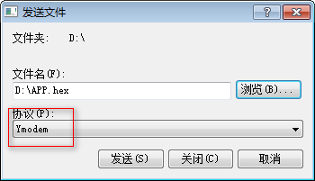
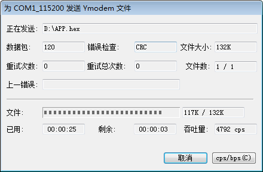

# XBOOT Command Line Reference

## 基础命令

本节对基础版XBOOT提供的命令进行描述。

### empty

FLASH查空命令，无参数，用来检测用户FLASH是否为空。

``` 
empty
 FLASHA is NOT empty @ 0x338000.
 FLASHB is NOT empty @ 0x330000.
 FLASHC is NOT empty @ 0x328000.
 FLASHD is empty @ 0x320000.
 FLASHE is empty @ 0x318000.
 FLASHF is empty @ 0x310000.
 FLASHG is empty @ 0x308000.
 FLASHH is empty @ 0x300000.
```

**注意**：C2000系列DSP的FLASH最小擦除单位是一个扇区，写入之前必须确保为空，否则需要先进行擦除。

### erase 

FLASH擦除命令。
erase命令接受一个字符串参数：abcdefgh，分别对应8个FLASH扇区。可以同时指定
多个FLASH扇区，如`erase bcd`命令将会擦除b c d三个flash扇区。

**注意**：erase a命令将擦除包括XBOOT在内所有FLASH内容，也包括加密密码，擦除所有
FLASH内容以后掉电之前，XBOOT仍然可以运行并且更新程序，如果擦除以后掉电，只能使用
仿真器将XBOOT写入DSP。将用户代码写入未擦除的FLASH运行结果将是不确定的。
 
```
empty
 FLASHA is NOT empty @ 0x338000.
 FLASHB is NOT empty @ 0x330000.
 FLASHC is NOT empty @ 0x328000.
 FLASHD is empty @ 0x320000.
 FLASHE is empty @ 0x318000.
 FLASHF is empty @ 0x310000.
 FLASHG is empty @ 0x308000.
 FLASHH is empty @ 0x300000.
erase c
 erase flash sector 0x04 OK.
empty
 FLASHA is NOT empty @ 0x338000.
 FLASHB is NOT empty @ 0x330000.
 FLASHC is empty @ 0x328000.
 FLASHD is empty @ 0x320000.
 FLASHE is empty @ 0x318000.
 FLASHF is empty @ 0x310000.
 FLASHG is empty @ 0x308000.
 FLASHH is empty @ 0x300000.
```

### reboot

重启系统。带一个延时参数，单位ms。执行reboot 1000即延时1秒以后重新启动，
无参数默认10ms延时以后重新启动。

```
reboot
 rebooting ...
reboot 500
 rebooting ...
```


### ymodem

使用ymodem协议更新用户软件。

执行ymodem命令，超级终端显示字符`C`以后，选择菜单`发送->发送文件`，文件名选择
用户程序的hex文件，协议选择Ymodem，点击发送即可。
 

 


```
ymodem
 warning: flash address 0x330000 is not empty, do not use it.
 ymodem update firmware, press A to abort ...
 CCCCCCC
  Update firmware OK!
  File Name: APP.hex
  File Size: 148517
  End Addr:  0x32F874
```

执行ymodem命令以后，超级终端显示C时，可以按字母a取消命令。

用户发送的APP固件，**不能使用FLASHA或者FLASHB**，否则将会损坏XBOOT固件。

### help 

显示XBOOT帮助信息。

```
help
 empty -> empty Check flash sector is empty or not.
 erase -> erase [abcdefgh] Erase flash sector.
 entry -> entry [hex addr] Get/Set user app entry.
 memrd -> memrd [hex addr] [hex len] Show Memory.
 goto -> goto [hex addr] to execute.
 eeprom -> eeprom [load|save|read|write] [addr] [data] Operate Int. EEPROM.
 uuid -> uuid [128bits hex string] Show/Setup UUID.
 reboot -> reboot [delay ms] Restart xboot.
 ymodem -> update user APPs.
 help -> help Info.
 version -> version display bootloader Info.
```

**注意**：基础版本不支持entry、memrd、goto、eeprom、uuid命令。

### version

显示XBOOT版本和版权信息。
 
```
version
 xboot v18.03.17 SN: 6D53150634C24E7C907C685707910F63
 for TMS320F28335 by ECHO Studio <echo.xjtu@gmail.com>.
 All Rights Reserved.
```

**注意**：没有写入唯一ID的DSP芯片，序列号SN内容为全FF。

## 高级命令

定制版XBOOT可以支持高级功能，通过本节提供的高级命令进行支持。

### entry

设置、查看用户程序入口点。

默认无参数查看当前用户程序入口点，带一个参数为设置用户程序入口点。
 
```
entry
 user app entry is 0x328000.
entry 320000
 set user app entry to 0x320000 .
entry
 user app entry is 0x320000.
```

### memrd 

读取DSP内存。内存地址包括SRAM、FLASH、地址。

memrd命令接受两个参数，第一个为要读取的内存地址，第二个为要读取的数据长度，
默认128。全部为十六进制。
 
```
memrd 328000

0x328000 0072 E301 761F 030D E801 D418 E2C4 0106
0x328008 E808 9378 E700 0040 7700 E68A 0000 7700
0x328010 761F 0305 BFA9 0F12 0F22 6905 0201 5601
0x328018 0022 6F09 761F 0312 0200 1A07 1000 761F
0x328020 0305 1E22 761F 030D E801 E118 E2C4 0106
0x328028 E80E B850 E700 0040 7700 E68A 0000 7700
0x328030 761F 0305 BFA9 0F12 0F24 6905 0201 5601
0x328038 0024 6F0D 761F 0312 1A07 0010 0200 1A07
0x328040 0080 1A07 0020 761F 0305 1E24 761F 030D
0x328048 E2C4 0006 7700 E68A 0000 7700 761F 0305
0x328050 BFA9 0F12 0F26 6905 0201 5601 0026 6F0B
0x328058 761F 0312 0200 1A07 0040 1A07 0800 761F
0x328060 0305 1E26 761F 030D E801 F260 E2C4 0106
0x328068 E80E 6668 E700 0040 7700 E68A 0000 7700
0x328070 761F 0305 BFA9 0F12 0F28 660A 8F00 C480
0x328078 44F4 6C03 1AFC 2000 0200 1E28 0006 0201
```

### goto

跳转到新地址执行。
接受一个复位向量作为参数。28335平台下goto 33fff6将会重启XBOOT，如图 11。
 
```
goto 33FFF6
 goto address 0x33FFF6 to execute...
```

### eeprom

读写DSP内部模拟EEPROM。带四个子命令：`read、write、load、save`。

- 读eeprom：eeprom read [地址] [长度]，其中地址为必要参数，长度可不填，默认128字，从内部缓存读取数据。
- 写eeprom：eeprom write [地址] [数据]，其中地址和数据均为必要参数，数据写入内部缓存。
- 加载eeprom：eeprom load，数据从FLASH加载到内部缓存。
- 存储eeprom：eeprom save，eeprom数据从内部缓存写入FLASH，掉电保存。

内置模拟eeprom总共255个16位字，前16个字预留给XBOOT自身使用，其余用户程序可用。
 
```
eeprom read 0

0x0000  8000 0032 FFFD 01F4 FFFF FFFF FFFF FFFF
0x0008  FFFF FFFF FFFF FFFF FFFF FFFF FFFF FFFF
0x0010  0003 0001 0028 FFFF 00F3 FFFF 0009 FFFF
0x0018  FFFF FFFF FFFF FFFF FFFF FFFF FFFF FFFF
0x0020  0002 0001 0028 FFFF 00F3 FFFF 0009 FFFF
0x0028  FFFF FFFF FFFF FFFF FFFF FFFF FFFF FFFF
0x0030  FFFF FFFF FFFF FFFF FFFF FFFF FFFF FFFF
0x0038  FFFF FFFF FFFF FFFF FFFF FFFF FFFF FFFF
0x0040  0002 0001 0028 FFFF 00F3 FFFF 0009 FFFF
0x0048  FFFF FFFF FFFF FFFF FFFF FFFF FFFF FFFF
0x0050  FFFF FFFF FFFF FFFF FFFF FFFF FFFF FFFF
0x0058  FFFF FFFF FFFF FFFF FFFF FFFF FFFF FFFF
0x0060  FFFF FFFF FFFF FFFF FFFF FFFF FFFF FFFF
0x0068  FFFF FFFF FFFF FFFF FFFF FFFF FFFF FFFF
0x0070  FFFF FFFF FFFF FFFF FFFF FFFF FFFF FFFF
0x0078  FFFF FFFF FFFF FFFF FFFF FFFF FFFF FFFF
```

### uuid

查看或者设置芯片的唯一ID。芯片的唯一ID可以用作芯片序列号、单板序列号、设备序列号。
还可以用来加密固件。许多现代MCU如STM8、STM32、STC本身提供了唯一ID，TI C2000系列
MCU没有提供唯一ID，XBOOT利用OTP存储空间来实现唯一ID功能。

不带参数的uuid命令可以显示当前DSP的uuid，如下所示： 

```
uuid
BBF2CE53C8B54062B42C3E8423AD9E88
```

如果单板没有设置uuid，uuid命令无输出。未写入uuid的单板，可以使用uuid命令写入uuid，
如下所示：

```
uuid BBF2CE53C8B54062B42C3E8423AD9E88
```

**注意**：一块单板uuid只能写入一次，要保证写入的uuid**每次都是重新生成的**，避免重复。
uuid写入以后，重新擦写FLASH均不受影响，更换uuid的唯一方法是更换新的芯片。
