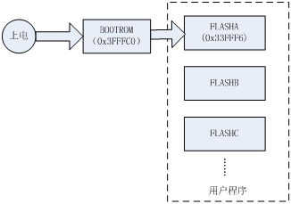
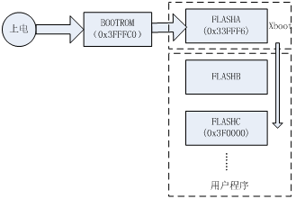
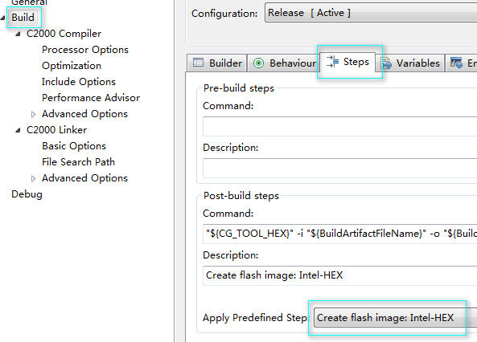
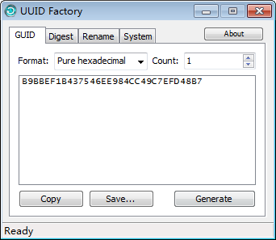

## 资源汇总

- [PI0049专用版下载](FW/PI0049/XBOOT_v19.6.20_PI0049.hex)
- [PI0049专用版命令行手册](DOC/XBOOT_PI0049_CmdRef.md)
- [PI035专用版下载](FW/PI035/XBOOT_v19.6.13_PI035.hex)
- [PI035专用版命令行手册](DOC/XBOOT_PI035_CmdRef.md)
- [通用基础版下载](FW/BASIC)
- [通用基础版PDF用户手册下载](DOC/XBOOT_28335用户手册v16.8.12.pdf)
- [通用基础版命令行手册](DOC/XBOOT_CmdRef.md)
- [发布日志](FW/ReleaseNotes.md)

## 特性介绍

XBOOT是一款TI C2000平台的bootloader软件，配合USBTTL，USBCAN等硬件，可以实现
C2000系列DSP固件IAP功能。

XBOOT分为基础版本和定制版本，基础版本免费，用于评估，无技术支持，定制版本
可用于商业场合，提供有限的技术支持。

### 基础版本特性

- 支持TMS320F28335/TMS320F28069/TMS320F28035。
- 28335使用30M外部晶振，28069/28035使用内部10M晶振。
- 支持1个CAN，28335支持3个UART，28069支持2个UART，28035支持1个UART，通讯GPIO固定。
- CAN接口波特率固定500kbps。
- 串口波特率固定115200bps。
- 无固件加密功能。
- 只支持1个用户程序，入口地址固定。
- 支持用户固件更新。

### 定制版本特性

- 支持C2000系列所有芯片（极少数FLASH过小的芯片除外）。
- 外部晶振频率可选。
- 支持一个CAN接口，3个TTL串口或者485接口，用于通讯的GPIO可选。
- CAN接口波特率可定值，默认500kbps。
- 串口波特率可定制，默认115200bps。
- 可自带固件加密功能，确保用户固件安全。
- 可读取FLASH、SRAM、外设内容。
- 支持最多6个用户程序。可以设置上电后自动运行的用户程序。
- 支持用户固件更新。
- 可访问内置模拟EEPROM。
- 可设置器件全球唯一ID，用于产品序列号，固件加密等场合。

### 硬件资源占用

- FLASH：FLASHA和FLASHB
- 定时器：CpuTimer0
- 通信接口
  1. SCIA (GPIO28/GPIO29)(28335/28069/28035)
  2. SCIB (GPIO22/GPIO23)(28335/28069)
  3. SCIC (GPIO62/GPIO63)(28335)
  4. ECANA (GPIO30/GPIO31)(28335/28069/28035)
- 由于跳转用户程序以后XBOOT不再运行，因此SRAM与用户程序无冲突。

## 工作原理

### C2000上电引导过程

C2000系列DSP上电以后从内部BOOTROM引导，上电复位以后DSP跳转到0x3FFFC0执行内部
BOOTROM中的代码，根据特定GPIO状态，判断引导模式，一般均使用FLASH引导模式，
即BOOTROM中代码执行完毕之后将控制权交给FLASH中的代码。

整个过程如下图所示：
 


### XBOOT工作原理

C2000内置BOOTROM通过GPIO来判断引导模式，单板设计时需要设计引导跳线，每次更新程序
要插拔跳线，使用不便。同时内部BOOTROM中的代码只能执行简单的代码更新功能。
 


实际中C2000系列DSP的FLASH空间往往十分充足，将FLASH按照扇区(sector)划分为几部分，
FLASHA包含了BOOTROM的跳转地址0x33FFF6，用来存放XBOOT程序；FLASHB用来模拟内置EEPROM；
剩下的所有FLASH存放用户程序。

上电以后，FLASHA中的XBOOT代码首先执行，根据串口或者CAN接口数据流判断进入用户程序
还是XBOOT shell，如果0.5秒内某个串口上连续收到5个字母’e’，进入XBOOT shell，
否则进入用户程序。该设计会带来上电0.5秒的上电延时，一般情况下可以接受，带来的好处
是硬件设计无需额外的跳线。XBOOT shell中可以执行用户固件IAP更新功能。

## 使用方法

### 进入XBOOT shell方法

XBOOT上电启动以后在0.5秒内检测串口输入，如果收到连续5个字母“e”，便进入XBOOT shell；
否则访问模拟EEPROM获取用户程序入口点，如果用户程序有效，执行用户程序，否则进入XBOOT shell。

使用超级终端连接串口，`波特率115200，8位数据，1位停止，无校验，无流控`。按住键盘上
的字母“e”，点击控制板上的复位按键，或者给控制板重新上电。可以进入XBOOT shell。

CAN接口借助UARTCAN或者USBCAN硬件，设置工作模式为桥接模式，其余使用方法与串口完全相同。

超级终端为Windows XP自带程序，通过`开始->所有程序->附件->通讯->超级终端`打开。
Windows7系统不带超级终端，可以将Windows XP系统的超级终端软件拷贝过去直接使用。

### 更新用户软件详细步骤

首先连接XBOOT shell，使用empty命令查看要写入的FLASH是否为空，如果不为空，使用
`erase x`命令擦除软件所在FLASH，其中x为FLASH名字，取值`a、b、c…`.

使用ymodem命令更新用户软件。

**注意**：erase a命令将擦除包括XBOOT在内所有FLASH内容，也包括加密密码，擦除所有
FLASH内容以后掉电之前，XBOOT仍然可以运行并且更新程序，如果擦除以后掉电，只能使用
仿真器将XBOOT写入DSP。将用户代码写入未擦除的FLASH运行结果将是不确定的。

## 用户软件编写指南

### 复位向量

TMS320F28335 FLASH入口地址为0x33FFF6，这个地址位于FLASHA，已经被XBOOT占用。
用户代码需要使用另外的复位向量。XBOOT默认会将入口地址设置到FLASHC开头两个字，
地址0x328000，上电后XBOOT可以跳转到FLASHC执行用户代码。

用户代码需要将复位向量放到所在FLASH扇区开始两个字。所有用户代码放在FLASHC，复位
向量占用FLASHC开始两个字。
 


定制版XBOOT固件可以使用entry命令重新设置复位向量，实现多APP支持。
由于XBOOT本身使用FLASHA和FLASHB，用户程序不能占用这两处FLASH，编写cmd文件时需要注意，
用户程序编译后注意检查map文件，确认两块FLASH没有使用。
 


### 生成hex文件

使用hex2000命令行工具将CCS编译生成的.out文件转化为hex文件。命令如下：

```
hex2000 --intel -romwidth 16 -memwidth 16 TEST.out
```

其中TEST.out为需要转化的.out文件，根据实际需要进行替换。.hex文件实际为文本文件，
可以使用文本编辑器打开查看。

CCS5可以设置编译完成自动输出hex文件，设置方法如下：

在工程名上按Alt+Enter打开项目属性设置页，然后按照下图设置即可。
 


## uuid生成指南

UUID含义是通用唯一识别码 (Universally Unique Identifier)，是指在一台机器上生成的
数字，它保证对在同一时空中的所有机器都是唯一的。通常使用一个16进制字符串表示，
如：`BBF2CE53C8B54062B42C3E8423AD9E88`。

### Linux

Linux平台下可以使用uuidgen命令生成uuid，注意输入时去掉中间的’-’分隔符。
 


### Windows

Windows平台下可以使用PDFFactory软件来生成uuid.
 


## 免责条款

### 基础版

使用方法请参考本文档，作者不提供任何技术支持与保证。

### 定制版

可用于商业场合。使用方法请参考本文档，同时作者会尽力满足客户需求，并提供有限的技术支持。
技术支持仅仅限于XBOOT固件本身，用户需要对最终产品测试负责，作者不提供用户产品的
技术支持与保证。用户使用XBOOT默认接受以上条款。
